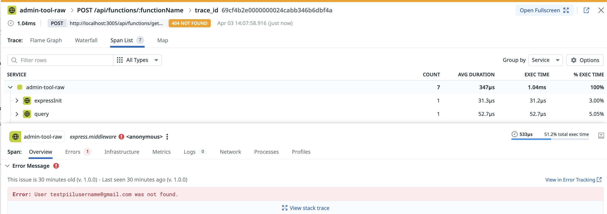
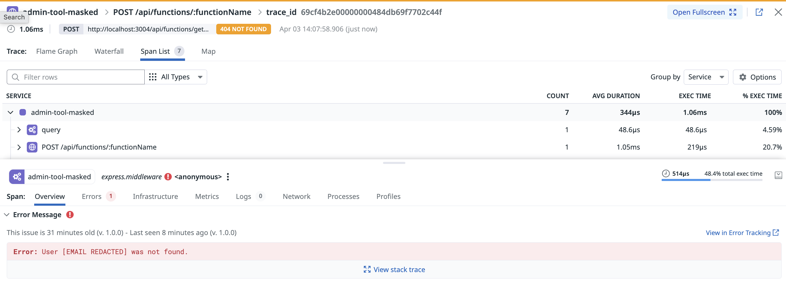

[English](#english) | [日本語](#日本語) | [繁體中文](#繁體中文)
🌐 **[Interactive Guide →](https://yuandesu.github.io/nodejs-pii-masking-demo/)**

---

## English

# Node.js PII Masking Demo

Side-by-side comparison of two identical Node.js apps — one with PII masking enabled, one without. Use this to see how the Datadog Agent's `replace_tags` feature redacts sensitive data (email addresses) from APM traces before they ever leave your infrastructure.

### What You'll See in Datadog

Two sets of traces in [Datadog APM → Traces](https://app.datadoghq.com/apm/traces):

- **`admin-tool-masked`** — email addresses replaced with `[EMAIL REDACTED]`
- **`admin-tool-raw`** — email addresses visible in the error message

### Prerequisites

- Docker & Docker Compose
- [Datadog](https://app.datadoghq.com) account and API key

### Quick Start

```bash
cp .env.example .env
# Edit .env and set DD_API_KEY=<your-api-key>
```

Start all 4 containers (2 apps + 2 agents):

```bash
env -u DD_API_KEY docker compose up -d --build
```

> `env -u DD_API_KEY` unsets any shell-level `DD_API_KEY` so the `.env` file value is used instead.

Send error traces to both apps:

```bash
for i in $(seq 1 5); do
  curl -s -X POST http://localhost:3004/api/functions/getUser \
    -H "Content-Type: application/json" \
    -d '{"email":"testpiilusername@gmail.com"}' > /dev/null

  curl -s -X POST http://localhost:3005/api/functions/getUser \
    -H "Content-Type: application/json" \
    -d '{"email":"testpiilusername@gmail.com"}' > /dev/null
done
```

Wait ~1 minute, then open **Datadog APM → Traces** and filter by `admin-tool-masked` or `admin-tool-raw`.

### Architecture

```
Port 3004 → admin-tool-masked → pii-agent-masked  (replace_tags: email → [EMAIL REDACTED])
Port 3005 → admin-tool-raw    → pii-agent-raw     (no masking)
```

### How PII Masking Works

The masked agent intercepts all traces **before forwarding them to Datadog** and applies a regex substitution via `replace_tags`. The raw PII never leaves your infrastructure.

```
App → dd-trace → [Datadog Agent applies replace_tags here] → Datadog backend
```

`datadog/datadog-masked.yaml`:

```yaml
apm_config:
  enabled: true
  replace_tags:
    - name: "*"
      pattern: "[a-zA-Z0-9_.+-]+@[a-zA-Z0-9-]+\\.[a-zA-Z0-9-.]+"
      repl: "[EMAIL REDACTED]"
```

| Field | Description |
|---|---|
| `name` | Tag to apply the rule to. `"*"` matches all tags including `error.message`, `user.email`, etc. |
| `pattern` | Regex to match within the tag value |
| `repl` | Replacement string |

You can also configure this without a file by passing `DD_APM_REPLACE_TAGS` as an environment variable to the Agent container.

### Expected Result in Datadog APM

**`admin-tool-raw`** — the raw email address appears in the error message span:



**`admin-tool-masked`** — the email is replaced with `[EMAIL REDACTED]` before the trace reaches Datadog:



### Cleanup

```bash
docker compose down
```

### Reference

https://docs.datadoghq.com/tracing/configure_data_security/

---

## 日本語

# Node.js PII マスキング デモ

2 つの同一 Node.js アプリを並べて比較します — 一方は PII マスキング有効、もう一方はなし。Datadog Agent の `replace_tags` 機能が、APM トレースからメールアドレスなどの機密データをインフラ外に送出される前に自動的に消去する様子を確認できます。

### Datadog で確認できること

[Datadog APM → Traces](https://app.datadoghq.com/apm/traces) の 2 組のトレース:

- **`admin-tool-masked`** — メールアドレスが `[EMAIL REDACTED]` に置換されている
- **`admin-tool-raw`** — エラーメッセージにメールアドレスがそのまま表示されている

### 前提条件

- Docker & Docker Compose
- [Datadog](https://app.datadoghq.com) アカウントと API キー

### クイックスタート

```bash
cp .env.example .env
# .env を編集して DD_API_KEY=<your-api-key> を設定
```

4 つのコンテナ（アプリ 2 + Agent 2）を起動:

```bash
env -u DD_API_KEY docker compose up -d --build
```

> `env -u DD_API_KEY` はシェルの環境変数 `DD_API_KEY` を一時的に除外し、`.env` ファイルの値が使われるようにします。

両アプリにエラートレースを送信:

```bash
for i in $(seq 1 5); do
  curl -s -X POST http://localhost:3004/api/functions/getUser \
    -H "Content-Type: application/json" \
    -d '{"email":"testpiilusername@gmail.com"}' > /dev/null

  curl -s -X POST http://localhost:3005/api/functions/getUser \
    -H "Content-Type: application/json" \
    -d '{"email":"testpiilusername@gmail.com"}' > /dev/null
done
```

約 1 分待ってから **Datadog APM → Traces** を開き、`admin-tool-masked` または `admin-tool-raw` でフィルタしてください。

### アーキテクチャ

```
ポート 3004 → admin-tool-masked → pii-agent-masked  (replace_tags: メール → [EMAIL REDACTED])
ポート 3005 → admin-tool-raw    → pii-agent-raw     (マスキングなし)
```

### PII マスキングの仕組み

マスキング済み Agent はすべてのトレースを **Datadog に転送する前に**インターセプトし、`replace_tags` で正規表現置換を適用します。生の PII はインフラ外に送信されません。

```
App → dd-trace → [ここで Datadog Agent が replace_tags を適用] → Datadog バックエンド
```

`datadog/datadog-masked.yaml`:

```yaml
apm_config:
  enabled: true
  replace_tags:
    - name: "*"
      pattern: "[a-zA-Z0-9_.+-]+@[a-zA-Z0-9-]+\\.[a-zA-Z0-9-.]+"
      repl: "[EMAIL REDACTED]"
```

| フィールド | 説明 |
|---|---|
| `name` | ルールを適用するタグ名。`"*"` は `error.message`、`user.email` など全タグに一致 |
| `pattern` | タグ値に対してマッチする正規表現 |
| `repl` | 置換後の文字列 |

設定ファイルなしで Agent コンテナに `DD_APM_REPLACE_TAGS` 環境変数を渡すことでも設定できます。

### Datadog APM での確認結果

**`admin-tool-raw`** — エラーメッセージスパンに生のメールアドレスが表示される:


**`admin-tool-masked`** — トレースが Datadog に届く前にメールアドレスが `[EMAIL REDACTED]` に置換済み:


### 終了

```bash
docker compose down
```

### 参考ドキュメント

https://docs.datadoghq.com/tracing/configure_data_security/

---

## 繁體中文

# Node.js PII 遮罩示範

並排比較兩個相同的 Node.js 應用程式 — 一個啟用 PII 遮罩，一個不啟用。用來觀察 Datadog Agent 的 `replace_tags` 功能如何在 APM traces 離開您的基礎架構之前，自動消除敏感資料（電子郵件地址）。

### 在 Datadog 中可以看到什麼

[Datadog APM → Traces](https://app.datadoghq.com/apm/traces) 中的兩組 traces：

- **`admin-tool-masked`** — 電子郵件地址被替換為 `[EMAIL REDACTED]`
- **`admin-tool-raw`** — 電子郵件地址直接顯示在錯誤訊息中

### 前置需求

- Docker & Docker Compose
- [Datadog](https://app.datadoghq.com) 帳號與 API 金鑰

### 快速啟動

```bash
cp .env.example .env
# 編輯 .env 並設定 DD_API_KEY=<your-api-key>
```

啟動所有 4 個容器（2 個 app + 2 個 agent）：

```bash
env -u DD_API_KEY docker compose up -d --build
```

> `env -u DD_API_KEY` 會取消 shell 層級的 `DD_API_KEY`，讓 `.env` 檔案中的值生效。

向兩個應用程式發送錯誤 traces：

```bash
for i in $(seq 1 5); do
  curl -s -X POST http://localhost:3004/api/functions/getUser \
    -H "Content-Type: application/json" \
    -d '{"email":"testpiilusername@gmail.com"}' > /dev/null

  curl -s -X POST http://localhost:3005/api/functions/getUser \
    -H "Content-Type: application/json" \
    -d '{"email":"testpiilusername@gmail.com"}' > /dev/null
done
```

等待約 1 分鐘，接著開啟 **Datadog APM → Traces**，以 `admin-tool-masked` 或 `admin-tool-raw` 進行篩選。

### 架構

```
Port 3004 → admin-tool-masked → pii-agent-masked  (replace_tags: 電子郵件 → [EMAIL REDACTED])
Port 3005 → admin-tool-raw    → pii-agent-raw     (無遮罩)
```

### PII 遮罩的運作原理

啟用遮罩的 Agent 在將所有 traces **轉送至 Datadog 之前**攔截，並透過 `replace_tags` 套用正規表達式替換。原始 PII 永遠不會離開您的基礎架構。

```
App → dd-trace → [Datadog Agent 在此套用 replace_tags] → Datadog 後端
```

`datadog/datadog-masked.yaml`：

```yaml
apm_config:
  enabled: true
  replace_tags:
    - name: "*"
      pattern: "[a-zA-Z0-9_.+-]+@[a-zA-Z0-9-]+\\.[a-zA-Z0-9-.]+"
      repl: "[EMAIL REDACTED]"
```

| 欄位 | 說明 |
|---|---|
| `name` | 套用規則的標籤名稱。`"*"` 符合所有標籤，包括 `error.message`、`user.email` 等 |
| `pattern` | 對標籤值進行比對的正規表達式 |
| `repl` | 替換後的字串 |

也可以不使用設定檔，直接將 `DD_APM_REPLACE_TAGS` 作為環境變數傳入 Agent 容器。

### 在 Datadog APM 中的預期結果

**`admin-tool-raw`** — 錯誤訊息 span 中顯示原始電子郵件地址：


**`admin-tool-masked`** — trace 抵達 Datadog 之前，電子郵件已被替換為 `[EMAIL REDACTED]`：


### 清理環境

```bash
docker compose down
```

### 參考文件

https://docs.datadoghq.com/tracing/configure_data_security/
